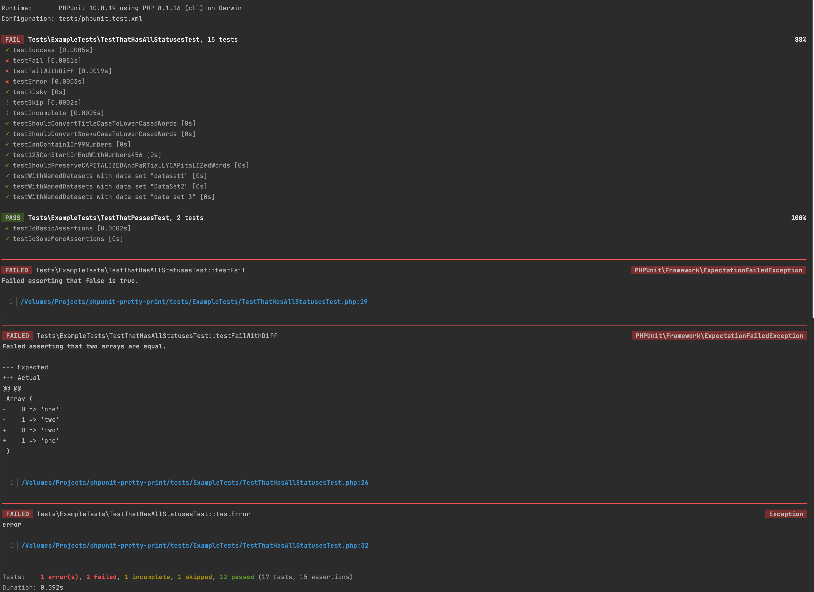

<h1 align="center">Better PHPUnit CLI output</h1>

<p align="center">
	
</p>

---

I really like how [Pest PHP](https://pestphp.com/) formats and outputs test results, 
but I still prefer to use [PHPUnit](https://phpunit.de/). 
That's why I decided to build a plugin that allows you to output test results just like Pest PHP does.

## Installation

```bash
composer require robiningelbrecht/phpunit-pretty-print --dev
```

This package requires:
* PHP `^8.1 || ^8.2`
* PHPUnit `^10`

## Configuration

Navigate to your `phpunit.xml.dist` file and following config:

```xml
<extensions>
    <bootstrap class="RobinIngelbrecht\PHPUnitPrettyPrint\PhpUnitExtension">
    </bootstrap>
</extensions>
```

### Options

* Prettify the method names that PHPUnit outputs

```xml
<extensions>
    <bootstrap class="RobinIngelbrecht\PHPUnitPrettyPrint\PhpUnitExtension">
        <parameter name="convertMethodNamesToSentences" value="true"/>
    </bootstrap>
</extensions>
```

* Feel good about yourself after running your testsuite by displaying a Chuck Noris quote

```xml
<extensions>
    <bootstrap class="RobinIngelbrecht\PHPUnitPrettyPrint\PhpUnitExtension">
        <parameter name="displayQuote" value="true"/>
    </bootstrap>
</extensions>
```

## Usage

Just run your testsuite like you normally would, but be sure to add `--no-output`* as an argument.

```bash
vendor/bin/phpunit --no-ouput
```

* <sub>We'll need this until https://github.com/sebastianbergmann/phpunit/issues/5168 lands and gets released.</sub>

<p align="center">
	
</p>

## Acknowledgements

* API used for Chuck Noris quotes: https://api.chucknorris.io/
* CLI output based on https://pestphp.com/
* Code to format methods to human-readable sentences from https://github.com/indentno/phpunit-pretty-print

