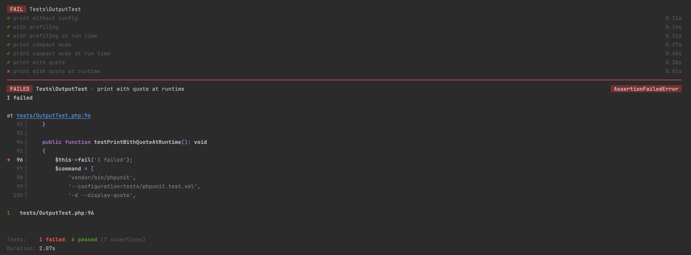
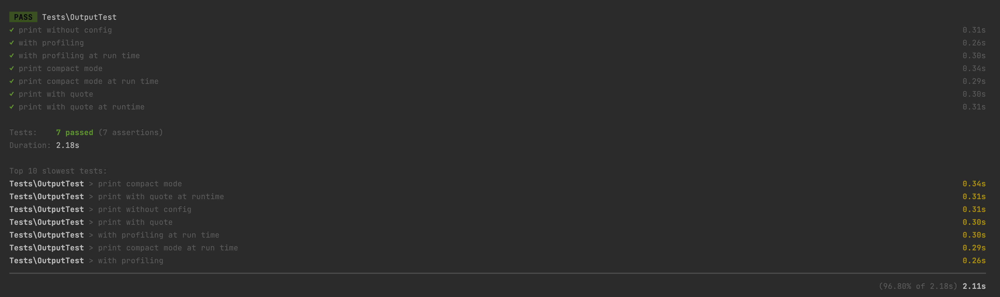
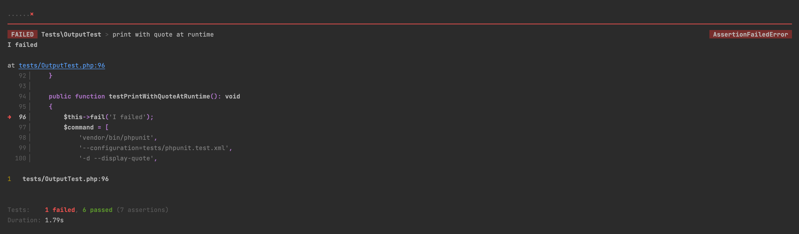
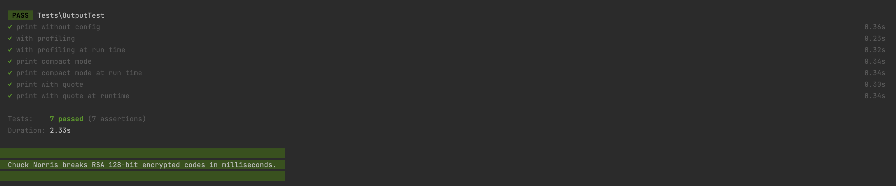

<h1 align="center">Better PHPUnit CLI output</h1>

<p align="center">
	
</p>

<p align="center">
<a href="https://github.com/robiningelbrecht/phpunit-pretty-print/actions/workflows/ci.yml"></a>
<a href="https://github.com/robiningelbrecht/phpunit-pretty-print/blob/master/LICENSE"></a>
<a href="https://phpstan.org/"></a>
<a href="https://php.net/"></a>
<a href="https://phpunit.de/"></a>
<a href="https://github.com/robiningelbrecht/phpunit-pretty-print"></a>
</p>

---

I really like how [Pest PHP](https://pestphp.com/) formats and outputs test results, 
but I still prefer to use [PHPUnit](https://phpunit.de/). Luckily there's [Collision](https://github.com/nunomaduro/collision).
This package is designed to give you beautiful error reporting when interacting with your app through the command line.

## Installation

```bash
composer require robiningelbrecht/phpunit-pretty-print --dev
```

## Configuration

Navigate to your `phpunit.xml.dist` file and add following config to set default options 
(you can also set these options at run time):

```xml
<extensions>
    <bootstrap class="RobinIngelbrecht\PHPUnitPrettyPrint\PhpUnitExtension">
    </bootstrap>
</extensions>
```

Also make sure the `color` attribute is set to `true`:

```xml
<phpunit 
        colors="true">
</phpunit>
```

### Options

* Output profiling report and the end of the test run

```xml
<extensions>
    <bootstrap class="RobinIngelbrecht\PHPUnitPrettyPrint\PhpUnitExtension">
        <parameter name="displayProfiling" value="true"/>
    </bootstrap>
</extensions>
```

* Use compact mode to only output the testsuite results instead of all separate tests

```xml
<extensions>
    <bootstrap class="RobinIngelbrecht\PHPUnitPrettyPrint\PhpUnitExtension">
        <parameter name="useCompactMode" value="true"/>
    </bootstrap>
</extensions>
```

* Feel good about yourself after running your testsuite by displaying a Chuck Noris quote

```xml
<extensions>
    <bootstrap class="RobinIngelbrecht\PHPUnitPrettyPrint\PhpUnitExtension">
        <parameter name="displayQuote" value="true"/>
    </bootstrap>
</extensions>
```

## Usage

```bash
> vendor/bin/phpunit
```

<p align="center">
	
</p>

Print profiling

```bash
> vendor/bin/phpunit -d --profiling
```

<p align="center">
	
</p>

Use compact mode

```bash
> vendor/bin/phpunit -d --compact
```

<p align="center">
	
</p>

Display Chuck Norris quote

```bash
> vendor/bin/phpunit -d --display-quote
```

<p align="center">
	
</p>

Combine multiple options

```bash
> vendor/bin/phpunit --configuration=tests/phpunit.test.xml -d --compact -d --display-quote
```

## Acknowledgements

* API used for Chuck Noris quotes: https://api.chucknorris.io/
* CLI formatting: https://github.com/nunomaduro/collision

